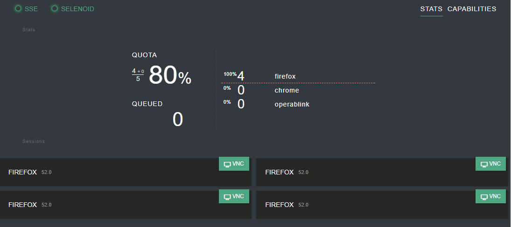

## Getting started with Selenium and Selenoid in Python

This project include a basis of [Selenoid Grid](https://aerokube.com/selenoid/latest/).
The environment defined in  [docker-compose.yml](./docker-compose.yml) file create an environment to
launch automated web tests in parallel with Docker. 



### Start the services

Run next in the current directory where `docker-compose.yml` file is present.
```sh
docker-compose up -d
```

Install dependencies
```
pip install -r requirements.txt
```
SET the environment variables 

|         |                        |
|---------|------------------------|
| URL     | https://rakuten.co.uk/ |
| BROWSER | chrome                 |
| HOST    | localhost              |


To view runned session open browser and follow to the link [http://localhost:8080](http://localhost:8080)

### Details

Read a detailed article about [Selenium in Docker](https://gainanov.pro/eng-blog/devops/selenium-in-docker-with-selenoid) where I explain details of the Selenoid.

> Also read to official materials about [Selenoid](https://aerokube.com/selenoid/latest)
